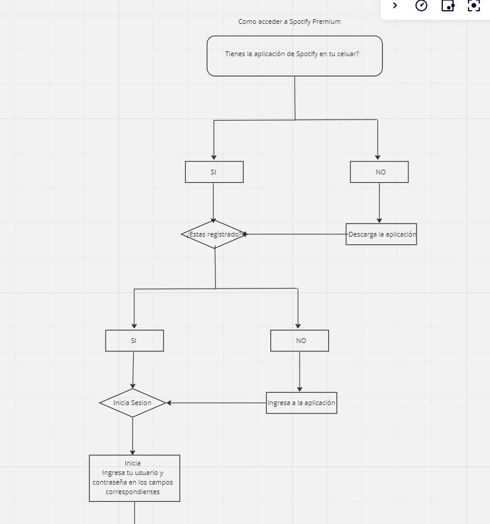
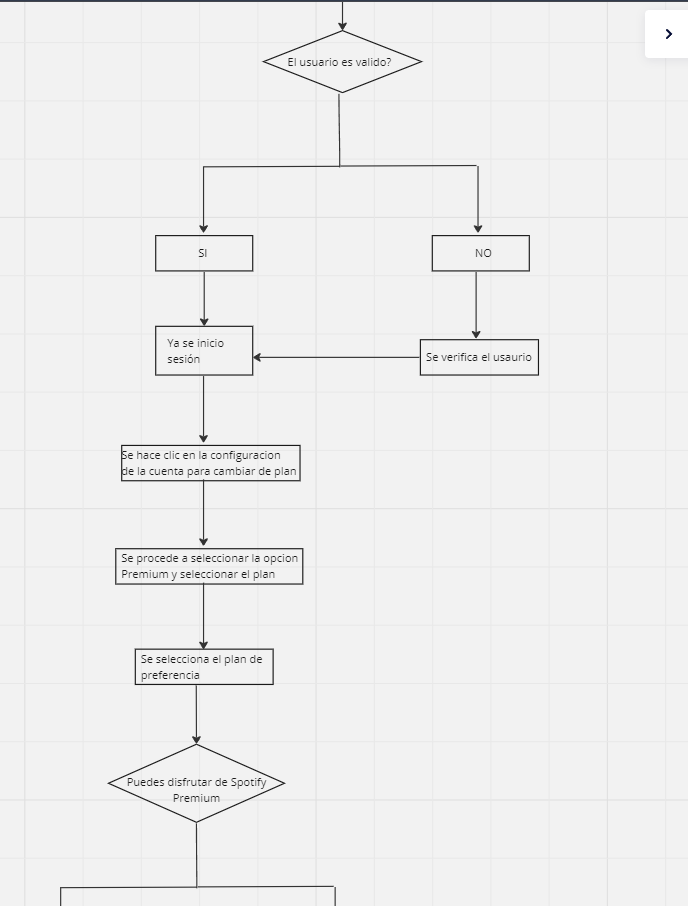
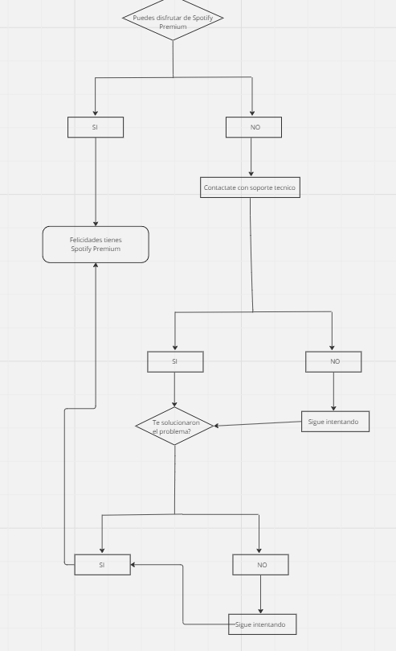

# Tarea #4

- Se creo la rama davidEchena-11-03-2024
- Se agrego el diagrama de flujo.
- *Se hizo commit "tarea(4): davidEchena-11-03-2024" y push.*
- Se agregaron 3 imagenes para poder el diagrama de flujo correctamente y estan enumeradas del 1al 3.
- Se hizo el diagrama de flujo sobre como tener una cuenta premiun en spotify.

