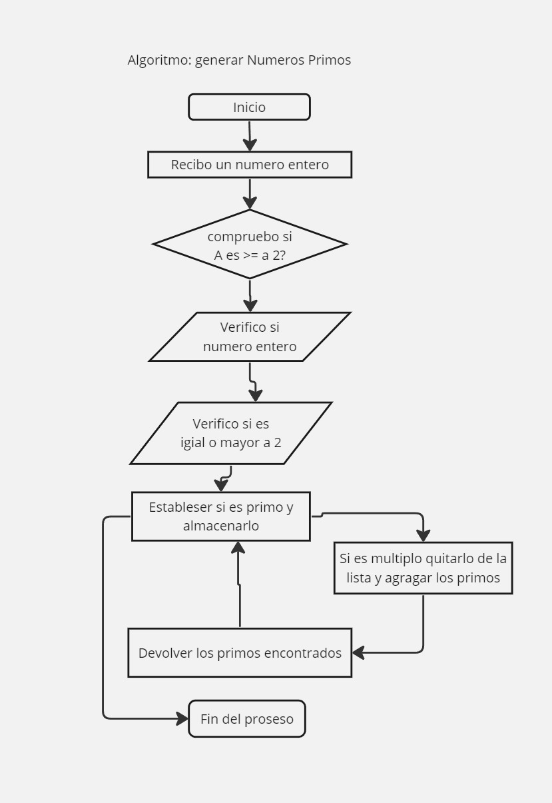

# tarea(5): Jorge-13-03-24

## Diagrama de flujo

# Funcion;

Este algoritmo Basado en traer a Pantalla los numeros primos, 
este algoritmos se bas en un inicio que nos permite 
ber el encabezado, donde recibe un numero entero comprieba que 
sea numero entero, que sea mayor a 2, 

Aplicamos un for para determinar si cumple las finciones den mismo para determinar si es un numero primo, de esa manera mostrar el resultado en consola.